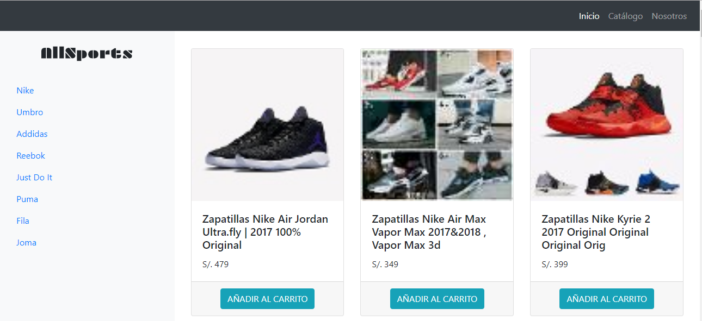

# E-commerce

***

## Objetivo

Construir un single page aplication SPA multiusuario consumiendo data remota del API de mercado libre. 

## Tecnologías usadas  

- Jquery  
- Boostrap 4  
- Javascript  
- Ecmascript 6  
- API mercado libre  
- Ajax  

 ## Resultado  

 

 #### Desarroladoras

* **Rocci Escobar:** [GitHub Account](https://github.com/Rocciescobar).
* **Alejandra Cabrera:** [GitHub Account](https://github.com/AlejandraCP). 
 
 
 

